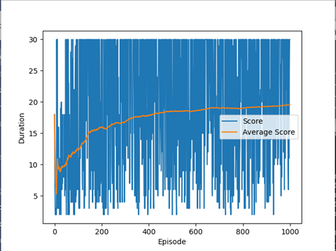
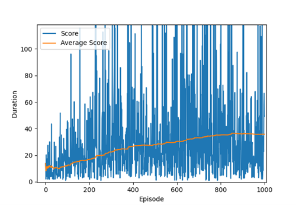
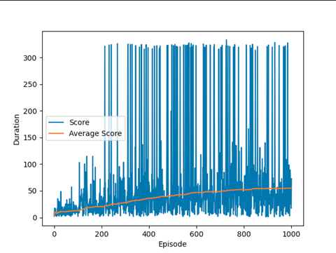

## Navigating-Complex-Highway-Scenarios-with-Advanced-RL-techniques-in-Highway-Env

This repository implements deep reinforcement learning algorithms for decision making in autonomous driving highway environment. We have used [highway-env](https://highway-env.readthedocs.io/en/latest/) as our environment and implemented DQN, DQN-MR, and DQN_PER algorithms for decision making. More information about the project can be found [here](https://github.com/swagholikar29/Navigating-Complex-Highway-Scenarios-with-Advanced-RL-techniques-in-Highway-Env/blob/main/RL_Project_Report.pdf).

## Repository Setup

Download the repository 'src' files into system.

In order to setup the repository locally on your system, open a new terminal and follow the instructions below:

    cd ~
    python3 -m venv rl_project
    source ~/rl_project/bin/activate

## Dependencies
- OS : [Ubuntu 20.04 LTS](https://releases.ubuntu.com/20.04/)
- Python : [3.9.13](https://www.python.org/downloads/release/python-3913/)
- PyTorch : [1.13.0](https://pytorch.org/)
- OpenAI Gym : [0.26.2](https://www.gymlibrary.dev/)

## Run Training
This section explains how to run the training code. Once the configuration is set, Change terminal directory to location of src files and run the python files using the command :

    python 3 'File_name.py'

## Output
This section shows the output performance of the algorithms.

### i. Videos
#### DQN
https://user-images.githubusercontent.com/44564963/206376512-077cf56a-ef74-4dc5-8aef-c9a5ca7aef8e.mp4
#### DQN-MR
https://user-images.githubusercontent.com/44564963/206376630-006774c7-4f95-4b37-b996-64f93856dc52.mp4
#### DQN-PER
https://user-images.githubusercontent.com/44564963/206376766-f89ee071-7fe4-4bf3-aff2-a2c8fd99b128.mp4

### ii. Training Plots

| **DQN**              | **DQN-MR**  |
|-----------------------------------------------------------------|-------------------------------------------------------------------|
| **DQN-PER**      |